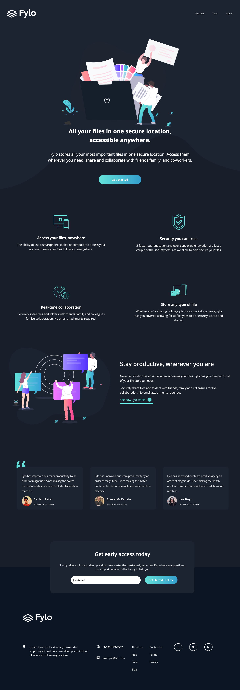

# Frontend Mentor - Fylo dark theme landing page solution

This is a solution to the [Fylo dark theme landing page challenge on Frontend Mentor](https://www.frontendmentor.io/challenges/fylo-dark-theme-landing-page-5ca5f2d21e82137ec91a50fd). Frontend Mentor challenges help you improve your coding skills by building realistic projects. 

## Table of contents

- [Overview](#overview)
  - [The challenge](#the-challenge)
  - [Screenshot](#screenshot)
  - [Links](#links)
- [My process](#my-process)
  - [Built with](#built-with)
  - [What I learned](#what-i-learned)
  - [Continued development](#continued-development)
  - [Useful resources](#useful-resources)
- [Author](#author)
- [Acknowledgments](#acknowledgments)

**Note: Delete this note and update the table of contents based on what sections you keep.**

## Overview

### The challenge

Users should be able to:

- View the optimal layout for the site depending on their device's screen size
- See hover states for all interactive elements on the page

### Screenshot



### Links

- [Solution URL](<https://github.com/lauriejefferson/frontend-mentor-solutions/tree/main/fylo-dark-theme-landing-page-master>)
- [Live Site URL](https://lauriejefferson.github.io/frontend-mentor-solutions/fylo-dark-theme-landing-page-master/index.html)

## My process

### Built with

- Semantic HTML5 markup
- CSS custom properties
- Flexbox
- CSS Grid
- Mobile-first workflow


### What I learned

#### Sematic HTML5


This project was somewhat challenging since the screen size in the design screenshot for the mobile layout had a width closer to 768px and not the normal 375px as stated in the style guide. I used Font Awesome svgs for the social media icons and added the CSS fill style to them on the hover state. For the main layout, I used CSS Grid for the desktop screens and a regular block format for mobile.  In order to check the email address in the early access form, I used the CSS visibility: hidden property and the email validation property on the form.  


```css
.social {
    display: grid;
    grid-template-columns: repeat(3, 400px);
    gap: 3em;

  }
```
```js
btn.addEventListener('click', (event) => {
  event.preventDefault();
  if (input.value && input.validity.patternMismatch === true) {
    errorMessage.style.visibility = 'visible';
  }
});
```

### Continued development

I would like to learn more about form validation using CSS only and not relying so much on JavaScript.  CSS Grid makes layout easy, so I will continue to use it for the main layout of projects (hero, sections, articles) and only use CSS Flexbox for menus and navigation.

### Useful resources

- [CSS Flexbox and Grid](https://webdesign.tutsplus.com/2-ways-to-build-a-sticky-footer-flexbox-and-css-grid--cms-107493t) - This helped with creating mobile and desktop navigation menus and layouts.

## Author

- Website - [Laurie Jefferson](https://github.com/lauriejeffersno)
- Frontend Mentor - [@lauriejefferson](https://www.frontendmentor.io/profile/lauriejefferson)

