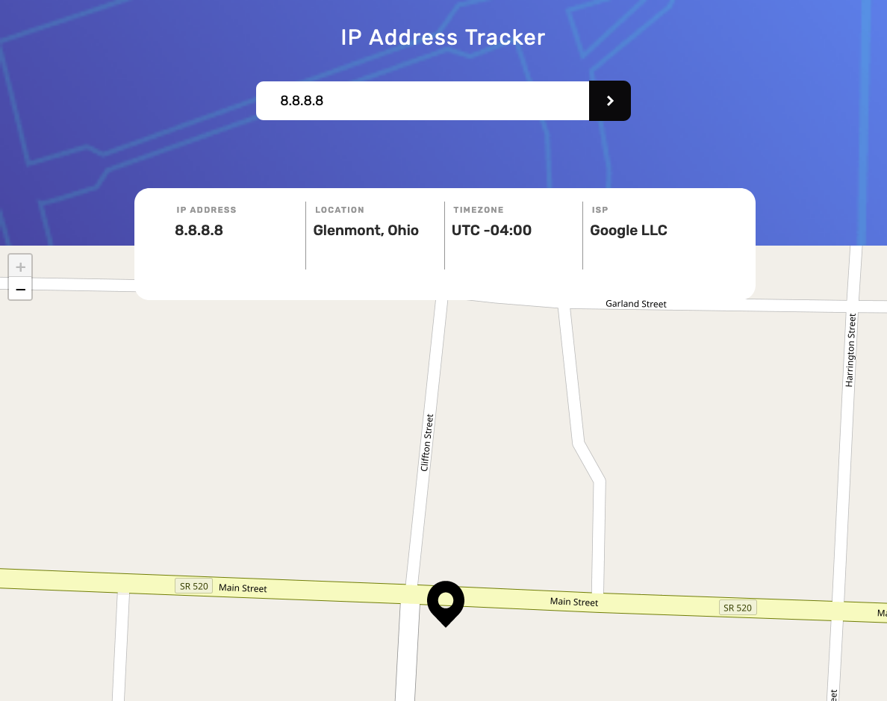

# Frontend Mentor - IP address tracker solution

This is a solution to the [IP address tracker challenge on Frontend Mentor](https://www.frontendmentor.io/challenges/ip-address-tracker-I8-0yYAH0). Frontend Mentor challenges help you improve your coding skills by building realistic projects. 

## Table of contents

- [Overview](#overview)
  - [The challenge](#the-challenge)
  - [Screenshot](#screenshot)
  - [Links](#links)
- [My process](#my-process)
  - [Built with](#built-with)
  - [What I learned](#what-i-learned)
  - [Continued development](#continued-development)
  - [Useful resources](#useful-resources)
- [Author](#author)
- [Acknowledgments](#acknowledgments)

**Note: Delete this note and update the table of contents based on what sections you keep.**

## Overview

### The challenge

Users should be able to:

- View the optimal layout for each page depending on their device's screen size
- See hover states for all interactive elements on the page
- See their own IP address on the map on the initial page load
- Search for any IP addresses or domains and see the key information and location

### Screenshot



### Links

- [Solution URL](https://github.com/lauriejefferson/frontend-mentor-solutions/tree/main/ip-address-tracker)
- [Live Site URL](https://your-live-site-url.com)

## My process

### Built with

- Semantic HTML5 markup
- CSS custom properties
- Vue 3 with Composition API
- Flexbox
- CSS Grid
- Ipify
- Leaflet JS
- OpenStreetMap
- Mobile-first workflow

### What I learned

#### Vue
 I wanted to get some practice using Vue 3, Vite and the Composition API, and this project was perfect for all three.   Vite exposes environmental variables through the import.meta.env object, which made it easy to store the Ipify API key.  The Vue 3 Composition API has a useful reactive function called ```ref()``` that allowed me to keep track of the changes in user input.  When the user enters an IP address and clicks the search button, Vue stores the input in a ```ref()``` variable ```ipAddress```.  The ```ref()``` variables ```ip```, ```location```, ```timezone``` and ```isp```   are Vue templates variable used to display the IP Address response data in the modal container.
 When the Vue project is mounted, I use the Vue Lifecycle hook ```onMounted``` to display the user IP Address information on initial page load.

#### CSS Flexbox 
I used CSS Flexbox to create the input for the IP address. Flexbox made it easy to position the input in the center of the container and give it a row orientation.  
 
#### CSS Grid 
I used CSS Grid to create the modal of the IP Address response data.  The modal needed four equal width columns for the IP Address, location, timezone and ISP.  I used ```grid-template-columns``` to create the four columns and the ```repeat()``` function to give them  equal widths.  I also used ```grid-template-rows``` to create a row of the IP address data, and give it the height required for the modal.

#### Ipify
Ipify was easy to use and start making API requests for the IP Address data. I created a ```.env``` file to store the Ipify API Key.  Next, I imported the environmental variable into my project using the Vite environmental variable object import.meta.env. When the user enters an IP address in the input field, its stored in the ```ref()``` variable ```ipAddress```  and then used make a ```fetch```  request to the Ipify Geolocation API to obtain the IP Address response data.  Finally the data is displayed in the Vue template using ```ref()``` variables ```ip```, ```location```, ```timezone``` and ```isp```.

#### Leaflet JS 
It was pretty straightforward to get Leaflet JS setup in my Vue project. I created an ```div``` with an ```id``` of ```mapContainer``` to mount the map.  I then created a function ```setupLeafletMap``` that sets up the map when the Vue project mounts, and centers the map.  The function also uses OpenStreetMap to display the IP Address geolocation coordinates.  When the user searches for an IP address, Vue will call the Ipify API and display the geolocation data on the map and zoom into the coordinates.  

### Continued development

Vue has a simple API and great documentation that allows any developer to get started with making apps.  I will continue learning about the Vue 3 Composition API, in particular Vue's reactivity system using the ```ref()``` function. I would like to use LeafLet JS in future Vue projects and create more geolocation apps in Vue.

### Useful resources

- [LogRocket - Building an interactive map with Vue and Leaflet](https://blog.logrocket.com/building-an-interactive-map-with-vue-and-leaflet/) - This blog post helped me get setup with Leaflet and Vue.

## Author

- Website - [Laurie Jefferson](https://www.github.com/lauriejefferson)
- Frontend Mentor - [@lauriejefferson](https://www.frontendmentor.io/profile/lauriejefferson)
