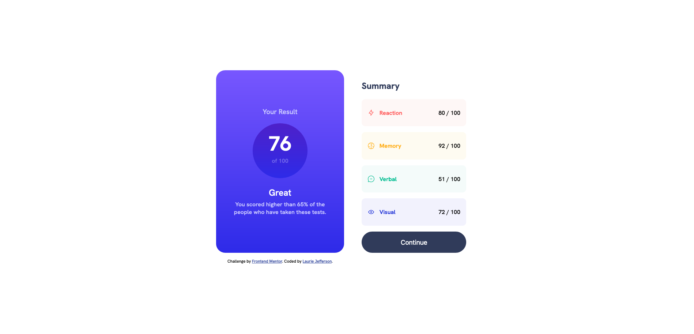

# Frontend Mentor - Results summary component solution

This is a solution to the [Results summary component challenge on Frontend Mentor](https://www.frontendmentor.io/challenges/results-summary-component-CE_K6s0maV). Frontend Mentor challenges help you improve your coding skills by building realistic projects. 

## Table of contents

- [Overview](#overview)
  - [The challenge](#the-challenge)
  - [Screenshot](#screenshot)
  - [Links](#links)
- [My process](#my-process)
  - [Built with](#built-with)
  - [What I learned](#what-i-learned)
  - [Continued development](#continued-development)
  - [Useful resources](#useful-resources)
- [Author](#author)
- [Acknowledgments](#acknowledgments)

**Note: Delete this note and update the table of contents based on what sections you keep.**

## Overview

### The challenge

Users should be able to:

- View the optimal layout for the interface depending on their device's screen size
- See hover and focus states for all interactive elements on the page

### Screenshot

### Links

- Solution URL: [Solution URL](https://github.com/lauriejefferson/frontend-mentor-solutions/tree/main/results-summary-component-main)
- Live Site URL: [Live Site URL](https://results-summary-component-lj.netlify.app/)

## My process

### Built with

- Semantic HTML5 markup
- CSS custom properties
- Flexbox
- CSS Grid
- Mobile-first workflow

### What I learned

I used CSS Grid to change the layout from vertical for mobile screens to horizontal for desktop screens. I also used CSS Flexbox to center containers on the screen and to align the content in a column direction.

### Continued development

I use CSS Flexbox and CSS Grid in my projects regularly, so for future projects I'll use more of the shorthand flex properties such as flex and flex-wrap. I would also like to use Container queries, and complex media queries.

### Useful resources

- [A Guide to CSS Flexbox](https://css-tricks.com/snippets/css/a-guide-to-flexbox/#aa-flexbox-properties) - This website helped with using CSS Flexbox properties.

## Author

- Website - [Laurie Jefferson](https://github.com/lauriejefferson)
- Frontend Mentor - [@lauriejefferson](https://www.frontendmentor.io/profile/lauriejefferson)

