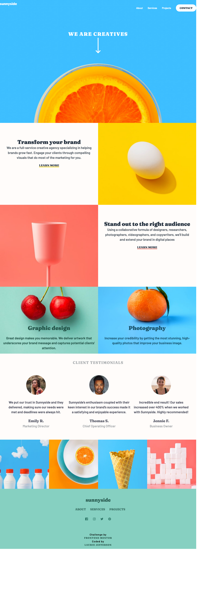

# Frontend Mentor - Sunnyside agency landing page solution

This is a solution to the [Sunnyside agency landing page challenge on Frontend Mentor](https://www.frontendmentor.io/challenges/sunnyside-agency-landing-page-7yVs3B6ef). Frontend Mentor challenges help you improve your coding skills by building realistic projects.

## Table of contents

- [Overview](#overview)
  - [The challenge](#the-challenge)
  - [Screenshot](#screenshot)
  - [Links](#links)
- [My process](#my-process)
  - [Built with](#built-with)
  - [What I learned](#what-i-learned)
  - [Continued development](#continued-development)
  - [Useful resources](#useful-resources)
- [Author](#author)
- [Acknowledgments](#acknowledgments)

**Note: Delete this note and update the table of contents based on what sections you keep.**

## Overview

### The challenge

Users should be able to:

- View the optimal layout for the site depending on their device's screen size
- See hover states for all interactive elements on the page

### Screenshot



### Links

- [Solution URL](https://github.com/lauriejefferson/frontend-mentor-solutions/tree/main/sunnyside-agency-landing-page-main)
- [Live Site URL](https://lauriejefferson.github.io/frontend-mentor-solutions/sunnside-agency-landing-page-main/)

## My process
The website has two areas where the layout changes when switching between screen sizes.  I used CSS Grid Area for the first two containers of the brand section that switch at smaller screen sizes and reset a maximum screen resolution.  I used CSS Grid for the image gallery to quickly change to a one to two-column layout. 

### Built with

- Semantic HTML5 markup
- CSS custom properties
- Flexbox
- CSS Grid
- Mobile-first workflow


### What I learned
I learned how to switch from horizontal to vertical layouts using CSS Grid Area.  CSS Grid also makes it easy to change the number of rows and columns for layouts like the image gallery and brand section in this challenge. The grid-area property makes it easy to assign sections of the grid to a container


```css
.main-grid {
  display: grid;
  grid-template-columns: 1fr;
  grid-template-rows: auto;
  grid-template-areas:
    "main__two"
    "main__one"
    "main__three"
    "main__four"
    "main__five"
    "main__six";
  width: 100%;
}
```

### Continued development

I found it useful to add grid-area to layouts that change with screen sizes, and will continue to use this CSS Grid property on future projects.  

### Useful resources

- [CSS Tricks CSS Grid Guide](https://css-tricks.com/snippets/css/complete-guide-grid/#prop-grid-area) - This guide helped me setup the grid-area and assign the grid area to items.
## Author

- Website - [Laurie Jefferson](https://github.com/lauriejefferson)
- Frontend Mentor - [@lauriejefferson](https://www.frontendmentor.io/profile/lauriejefferson)


