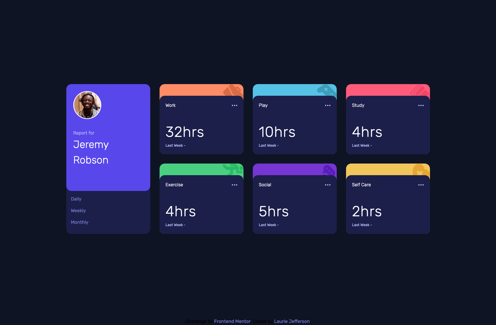

# Frontend Mentor - Time tracking dashboard solution

This is a solution to the [Time tracking dashboard challenge on Frontend Mentor](https://www.frontendmentor.io/challenges/time-tracking-dashboard-UIQ7167Jw). Frontend Mentor challenges help you improve your coding skills by building realistic projects. 

## Table of contents

- [Overview](#overview)
  - [The challenge](#the-challenge)
  - [Screenshot](#screenshot)
  - [Links](#links)
- [My process](#my-process)
  - [Built with](#built-with)
  - [What I learned](#what-i-learned)
  - [Continued development](#continued-development)
  - [Useful resources](#useful-resources)
- [Author](#author)
- [Acknowledgments](#acknowledgments)

**Note: Delete this note and update the table of contents based on what sections you keep.**

## Overview

### The challenge

Users should be able to:

- View the optimal layout for the site depending on their device's screen size
- See hover states for all interactive elements on the page
- Switch between viewing Daily, Weekly, and Monthly stats

### Screenshot




### Links

- Solution URL: [Add solution URL here](https://your-solution-url.com)
- Live Site URL: [Add live site URL here](https://your-live-site-url.com)

## My process

### Built with

- Semantic HTML5 markup
- CSS custom properties
- Flexbox
- CSS Grid
- Mobile-first workflow


### What I learned

In this project, I used CSS Grid for both the mobile and desktop layout. The CSS Grid repeat() function helped with creating a 4x4 grid to setup the layout.  I also used the grid-row and grid-column properties to span the profile and each time tracker type over the grid areas.  To display the time tracker data,  I used the JavaScript Fetch API to create an ansyc function that grabs the data.json data and adds the current and previous time tracker data to the DOM.

```html
<h1>Some HTML code I'm proud of</h1>
```
```css
.grid {
 display: grid;
 gap: 2em;
 grid-template-columns: repeat(4, 1fr);
 grid-template-rows: repeat(4, 1fr);
 width: 85%;
}
```
```js
async function getData() {
  try {
    const response = await fetch('data.json');
    const res = await response.json();
    return res;
  } catch (err) {
    console.error(err);
  }
}

const result = await getData();
const data = Object.values(result);
console.log(data);
```

### Continued development

I will continue to focus on CSS Grid, particulary CSS Subgrid. CSS Subgrid is a great tool to align child containers within a main parent container.  I also want to use the grid-template-rows more when a container has a header and footer that matches the height of their areas, and a main section that uses up the remaining space. 

### Useful resources

- [Kevin Powell - Simplify your CSS with these 3 grid layout solutions](https://www.youtube.com/watch?v=JHregeIsjPQ) - This video helped with using grid-row and grid-column to span the profile and time tracker containers.


## Author

- Website - [Laurie Jefferson](https://github.com/lauriejefferson)
- Frontend Mentor - [@lauriejefferson](https://www.frontendmentor.io/profile/lauriejefferson)

